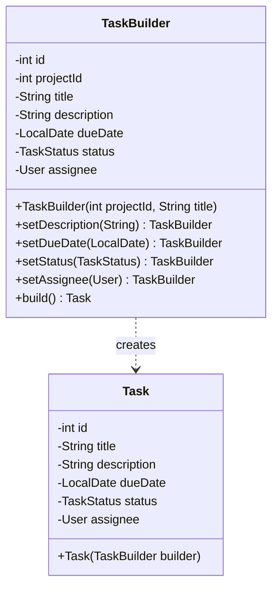
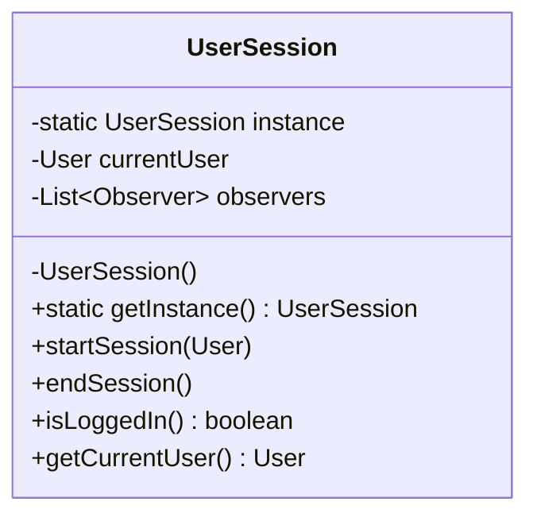
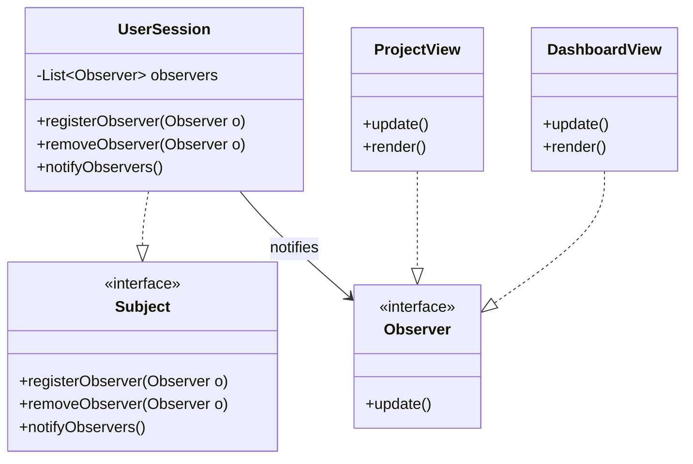
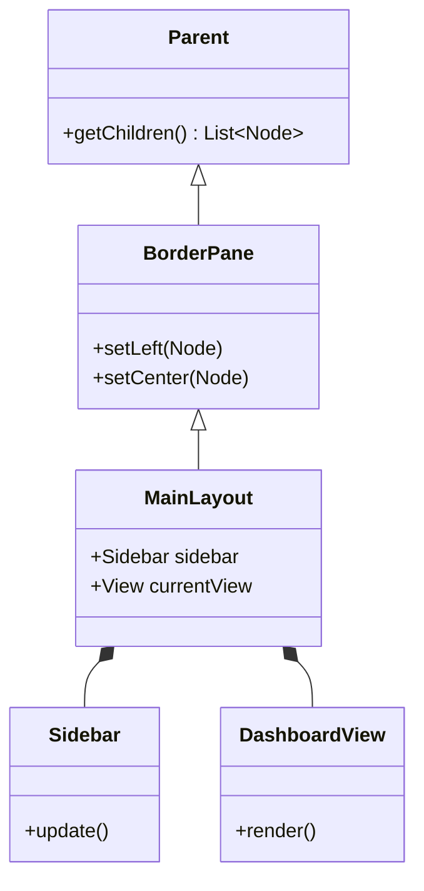

# Class Diagrams: Design Patterns

Berikut adalah diagram kelas untuk Design Pattern yang diterapkan dalam proyek ini.

## 1. Builder Pattern

Digunakan pada `TaskBuilder` untuk mempermudah pembuatan objek `Task` yang memiliki banyak atribut opsional.

## 2. Singleton Pattern

Digunakan pada `UserSession` untuk memastikan hanya ada satu sesi pengguna yang aktif dalam aplikasi.

## 3. Observer Pattern

Digunakan untuk menghubungkan `UserSession` (Subject) dengan View seperti `DashboardView` (Observer), sehingga UI otomatis diperbarui saat status login berubah.

## 4. Composite Pattern

Diterapkan secara natural melalui struktur **JavaFX Scene Graph**. `MainLayout` (sebagai Composite) menampung komponen lain seperti `Sidebar` dan `View` (sebagai Leaf atau Composite lainnya).

