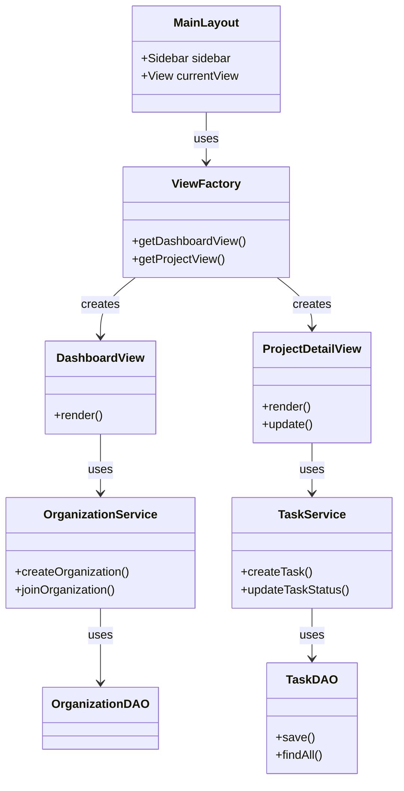

# Presentasi Proyek Java Task Management

## Slide 1: Judul Proyek

**Java Task Management System**

- **Nama Pengembang**: [Nama Anda / Tim]
- **NIM**: [NIM Anda]
- **Mata Kuliah**: Pemrograman Berorientasi Objek
- **Deskripsi Singkat**: Aplikasi desktop manajemen tugas berbasis Kanban Board menggunakan JavaFX dan MySQL.

---

## Slide 2: Penerapan Design Pattern (20 Poin)

Aplikasi ini menerapkan lebih dari 3 Design Pattern untuk modularitas dan maintainability:

1.  **Singleton Pattern**:

    - **Penerapan**: `UserSession`, `AppState`, `OrganizationService`, `ProjectService`.
    - **Tujuan**: Memastikan hanya ada satu instance yang mengelola sesi pengguna dan state aplikasi di seluruh siklus hidup program.
    - **Contoh Code**: `UserSession.getInstance()`

2.  **Observer Pattern**:

    - **Penerapan**: Interface `Subject` dan `Observer`.
    - **Tujuan**: .
    - **Contoh Code**: `organizationService.registerObserver(this)` pada View.

3.  **DAO (Data Access Object) Pattern**:

    - **Penerapan**: `UserDAO`, `OrganizationDAO`, `ProjectDAO`, `TaskDAO`.
    - **Tujuan**: Memisahkan logika bisnis dari logika akses database (SQL).

4.  **Factory Pattern**:

    - **Penerapan**: `ViewFactory`.
    - **Tujuan**: Sentralisasi pembuatan objek View dan manajemen dependensinya.

5.  **Builder Pattern**:
    - **Penerapan**: `TaskBuilder`.
    - **Tujuan**: Memudahkan pembuatan objek `Task` yang kompleks dengan banyak parameter opsional.

---

## Slide 3: Penerapan JUnit (15 Poin)

Pengujian unit dilakukan untuk memastikan logika bisnis berjalan benar.

- **Lokasi Test**: `src/test/java/`
- **Cakupan Pengujian**:
  - `AuthServiceTest`: Menguji login, register, dan validasi password.
  - `TaskServiceTest`: Menguji pembuatan, pengeditan, dan penghapusan tugas.
  - `OrganizationServiceTest`: Menguji logika join organisasi dan validasi owner.
- **Contoh Kasus Uji**:
  - `testRegisterSuccess()`: Memastikan user baru bisa terdaftar.
  - `testCreateTask()`: Memastikan task tersimpan dengan atribut yang benar.

---

## Slide 4: Penerapan Java Collections Framework (JCF) (10 Poin)

Aplikasi memanfaatkan JCF untuk pengelolaan data in-memory yang efisien.

1.  **List & ArrayList**:

    - Digunakan secara luas untuk menyimpan daftar tugas, proyek, dan organisasi.
    - Contoh: `List<Task> tasks = new ArrayList<>();`

2.  **Stream API**:

    - Digunakan untuk memfilter dan memproses koleksi data secara deklaratif.
    - **Contoh**: Memfilter task berdasarkan status di `ProjectDetailView`.

    ```java
    List<Task> todoTasks = allTasks.stream()
        .filter(t -> t.getStatus() == TaskStatus.TODO)
        .collect(Collectors.toList());
    ```

3.  **Optional**:
    - Digunakan untuk menangani nilai yang mungkin null dari database (misal: pencarian user by ID).
    - Contoh: `Optional<User> user = userDAO.findById(id);`

---

## Slide 5: Penerapan Clean Code (15 Poin)

Kode ditulis dengan prinsip Clean Code agar mudah dibaca dan dipelihara.

1.  **Meaningful Names**: Penamaan variabel dan method yang deskriptif (contoh: `getTasksByProject`, `isUserLoggedIn`).
2.  **Single Responsibility Principle (SRP)**:
    - `View` hanya mengurus UI.
    - `Service` hanya mengurus logika bisnis.
    - `DAO` hanya mengurus database.
3.  **Small Functions**: Method dibuat kecil dan fokus pada satu tugas.
4.  **No Hardcoding**: Menggunakan konstanta dan konfigurasi (misal: `DBConnection`).
5.  **Error Handling**: Penggunaan `try-catch` yang tepat dan pesan error yang informatif kepada pengguna.

---

## Slide 6: Penerapan Generic Programming (15 Poin)

Generics digunakan untuk Type Safety (keamanan tipe data) saat kompilasi.

1.  **Collections**:
    - Penggunaan `List<Task>`, `List<Project>`, `List<Organization>` memastikan list hanya berisi objek yang sesuai.
2.  **JavaFX Controls**:
    - `ComboBox<String>`: Memastikan combo box hanya menerima string.
    - `TableView<Task>`: (Jika digunakan) memastikan tabel terikat pada model Task.
3.  **Interfaces**:
    - Penggunaan interface `Observer` yang dapat diimplementasikan oleh berbagai kelas View yang berbeda namun diperlakukan sama oleh Subject.

---

## Slide 7: Penerapan GUI (JavaFX) (15 Poin)

Antarmuka pengguna dibangun menggunakan JavaFX dengan pendekatan modern.

1.  **Layout Managers**:
    - `BorderPane` untuk layout utama (Sidebar + Content).
    - `VBox` dan `HBox` untuk penyusunan komponen vertikal/horizontal.
    - `StackPane` untuk Modal Dialog.
2.  **CSS Styling**:
    - Pemisahan style ke file `styles.css`.
    - Penggunaan class CSS seperti `.primary-button`, `.card`, `.kanban-column`.
3.  **Event Handling**:
    - Lambda expressions untuk menangani aksi tombol (`setOnAction`).
    - Drag and Drop event handler untuk Kanban Board.
4.  **Custom Components**:
    - Pembuatan `Card` kustom untuk menampilkan ringkasan proyek/organisasi.

---

## Slide 8: Design Diagram Kelas (10 Poin)

**Arsitektur MVC (Model-View-Controller/Service)**



- **View**: Menampilkan UI (`DashboardView`, `ProjectView`).
- **Service**: Logika bisnis (`TaskService`, `OrganizationService`).
- **DAO**: Akses data (`TaskDAO`, `OrganizationDAO`).
- **Model**: Representasi data (`Task`, `User`, `Project`).
